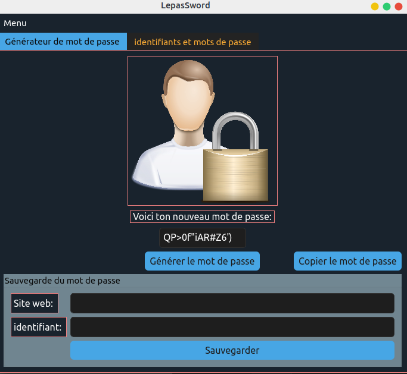
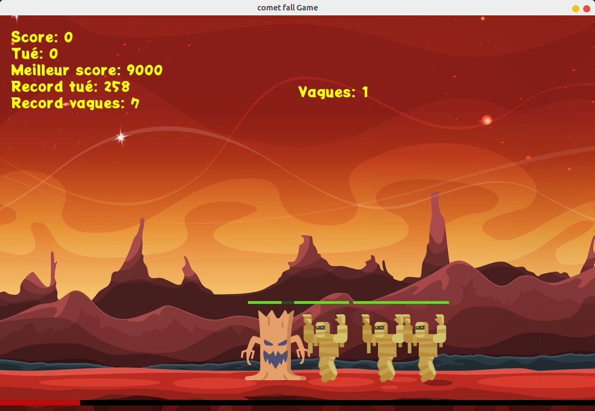

<!--
**Thepas/Thepas** is a ✨ _special_ ✨ repository because its `README.md` (this file) appears on your GitHub profile.

Here are some ideas to get you started:

- 🔭 I’m currently working on ...
- 🌱 I’m currently learning ...
- 👯 I’m looking to collaborate on ...
- 🤔 I’m looking for help with ...
- 💬 Ask me about ...
- 📫 How to reach me: ...
- 😄 Pronouns: ...
- ⚡ Fun fact: ...
-->

  

 

<h2> Hi there 👋  
I'm <strong>Lepas Milandou-Effeil</strong> 
an IT developper, Mechatronic engineer, Web Developper and Embedded software developper </h2>

## What & Whrere I am currently working at/on/as

 I am currently looking for a job, in the meantime I am working on different personal projects

## A few personal projects
<h3>LepasSword, a password generator (Ongoing)</h3>

 

 Programming Language: 

Coming Soon: A website format with API
 

 Programming Language: 
    
    

 

<h3>Comet fall Game</h3>

 

 Programming Language: 

 

<h3>My movies, series and animes (repo is private for the moment)</h3>

 A website that lists all the movies, series, anime 
    that I have already watched with the help of the API of the website betaseries.com 

 Programming Language: 
        
        

 

<h3>GrandChase AutoTouch script</h3>

Some scripts written in javascript for the "AutoTouch" tool which allows to make automatic touches on IOS 

 Programming Language: 
        

## Programming Languages

## Tools

## IDE

## GitHub Statistics

